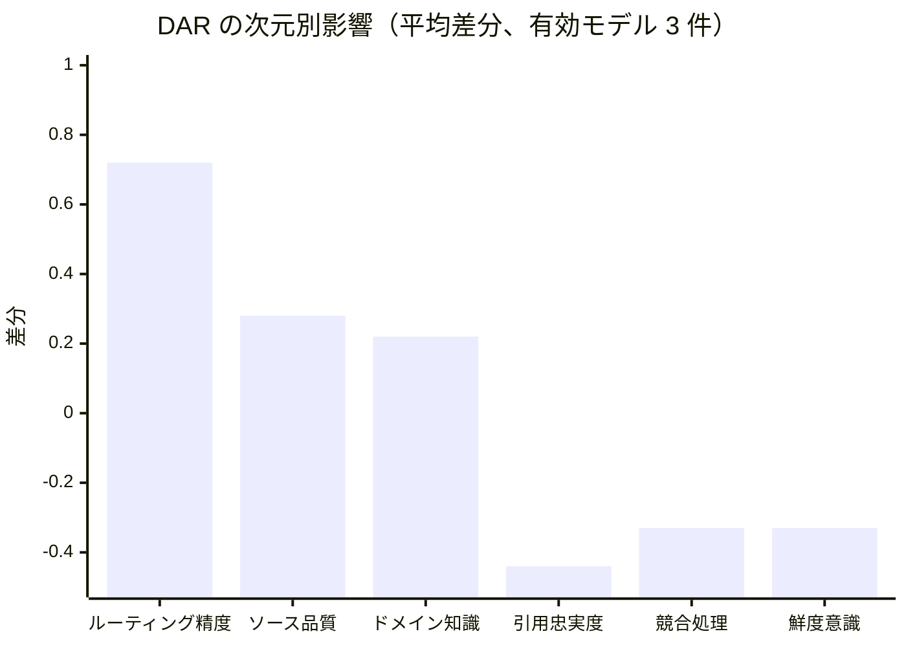

# Rule Hub — 統合 AI コラボレーションルール（日本語）

[English](README.md) | [中文](README.zh.md) | [日本語](README.ja.md)


> 1 つのリポジトリに 6 つの独立ルール体系を統合：共有コア層 + 単一プロファイル + オンデマンド機能パック。
> 一度クローンし、プロファイルを選択、任意の AI ツールのルールファイルへ同期生成。

---

## このリポジトリについて

本リポジトリは **AI コラボレーションルールの唯一の正ソース** であり、特定プロジェクトの業務コードではありません。以前は別々だった 6 つのルールリポジトリを 1 つに統合しています。各プロファイルは分離ロードされ、領域制約の衝突（例：「捏造禁止」と「小説執筆では創作が核心能力」）を回避します。

| プロファイル | 由来 | 用途 |
|---|---|---|
| `coding` | badhope/AI | ソフトウェア開発、バグ修正、リファクタリング、コードレビュー |
| `conversation` | badhope/universal | 一般 Q&A、リサーチ、比較、情報検索 |
| `novel` | badhope/novel | 小説執筆、章作成、キャラクター・世界構築 |
| `interactive-novel` | badhope/interactive-novel | インタラクティブフィクション、分岐叙事、状態機械 |
| `paper` | badhope/paper | 論文執筆、文献レビュー、投稿 |
| `agent-builder` | badhope/AgentCreater | AI エージェントの設計、評価、デプロイ |

**統合の理由**：5 つのルールセットの drift を防ぐ。5 つではなく 1 つのリポジトリをクローンする。クロスツール同期エントリポイントを統一する。

**1 つに統合しない理由**：領域制約が互いに矛盾する（例：「捏造禁止」と「創作は核心能力」）。プロファイルは分離ロードしなければならない。

## クイックスタート

### 1. クローン

```bash
git clone https://gitcode.com/badhope/AI-RULE.git
cd AI-RULE
```

### 2. プロファイルを選択してツールエントリを生成

```bash
# 利用可能なプロファイル一覧
python scripts/sync_rules.py --list

# coding プロファイルの Claude Code エントリを生成
python scripts/sync_rules.py --profile coding --tool claude-code

# AGENTS.md を生成（クロスツール標準、Codex CLI、OpenCode、Aider 等が読み取り）
python scripts/sync_rules.py --profile coding --tool agents-md

# novel プロファイルの全 13 プラットフォームエントリを生成
python scripts/sync_rules.py --profile novel --tool all
```

### 対応プラットフォーム（13）

| カテゴリ | Tool ID | 出力ファイル | 備考 |
|----------|---------|-------------|------|
| クロスツール標準 | `agents-md` | `AGENTS.md` | Codex CLI、OpenCode、Aider、Zed、Warp、Junie、Devin、Google Jules 等 20+ が読み取り |
| 既存 | `claude-code` | `CLAUDE.md` | Claude Code |
| 既存 | `gemini` | `GEMINI.md` | Gemini CLI |
| 既存 | `cursor` | `.cursor/rules/project.mdc` | Cursor（frontmatter 付き） |
| 既存 | `copilot` | `.github/copilot-instructions.md` | GitHub Copilot |
| 既存 | `trae` | `.trae/rules/project_rules.md` | Trae IDE |
| 海外 | `windsurf` | `.windsurfrules` | Windsurf（12K 文字制限） |
| 海外 | `cline` | `.clinerules/project.md` | Cline / Kilo Code |
| 海外 | `continue` | `.continue/rules/project.md` | Continue.dev |
| 海外 | `amazon-q` | `.amazonq/rules/project.md` | Amazon Q Developer |
| 海外 | `qodo` | `best_practices.md` | Qodo（旧 Codium） |
| 中国 | `lingma` | `.lingma/rules/project.md` | 通義霊碼（10K 文字制限） |
| 中国 | `comate` | `.comate/rules/project.mdr` | 文心快碼（.mdr 形式） |

### 3. プロジェクトで利用する

生成されたツールエントリファイル（例：`CLAUDE.md`）をプロジェクトルートにコピーするか、本リポジトリを Git サブモジュールとして参照し同期スクリプトを実行します。

### 4. AI にロードするプロファイルを伝える

```text
Rule Hub から coding Profile をロードしてください。
```

またはプロジェクトアンカーによる自動検出に任せます（下記参照）。

## プロファイル選択

### 明示指定（推奨）

```text
Rule Hub から <profile-id> Profile をロードしてください。
```

### プロジェクトアンカーによる自動検出

| アンカー信号 | 推定プロファイル |
|---|---|
| `pyproject.toml`、`package.json`、`requirements.txt` + ソースコード | `coding` |
| `.ai-memory/creative-blueprint.md`、`chapters/`、`outline.md` | `novel` |
| `.game-state/`、`game-state-machine.md`、`save-slot-*.json` | `interactive-novel` |
| `config.yaml` + `tools.json` + `test-cases.md` | `agent-builder` |
| 上記いずれも該当しない | `conversation` |

### インテントキーワード

| キーワード | プロファイル |
|---|---|
| 修正 / リファクタ / テスト / API / バグ | `coding` |
| 章を書く / 続き / キャラクター / 伏線 / 世界観 | `novel` |
| ゲーム開始 / 分岐 / セーブ / NPC / ターン | `interactive-novel` |
| Agent 設計 / エージェント設定 / ツール権限 | `agent-builder` |
| 検索 / 比較 / 分析 / リサーチ | `conversation` |

## 6 つのプロファイル

### coding（ソフトウェア開発）
- **由来**：badhope/AI
- **対象**：Python/FastAPI 開発、バグ修正、リファクタリング、テスト、コードレビュー
- **核心能力**：Git SOP、依存関係管理、PowerShell 構文、MCP レッドライン、エンジニアリング衛生
- **機能パック**：research、testing、review、agent-governance、dar
- **排他**：novel、interactive-novel

### conversation（一般会話）
- **由来**：badhope/universal
- **対象**：一般 Q&A、リサーチ、比較、情報検索
- **核心能力**：真実性プロトコル、ディープサーチ、アンチダムダウン、確認プロトコル、推論深度制御
- **機能パック**：research、dar
- **排他**：novel、interactive-novel、agent-builder

### novel（小説執筆）
- **由来**：badhope/novel
- **対象**：小説執筆、章作成、キャラクター・世界観の維持
- **核心能力**：創作シード確認、35 項目のアンチ AI 文体チェックリスト、キャラクター一貫性、伏線追跡、ストーリー知識グラフ、三層リビジョン
- **機能パック**：research、worldbuilding、creative、dar
- **排他**：coding、conversation、interactive-novel、agent-builder

### interactive-novel（インタラクティブフィクション）
- **由来**：badhope/interactive-novel
- **対象**：インタラクティブフィクションゲーム、分岐叙事、状態機械駆動
- **核心能力**：ゲームシード、状態機械、NPC 自律性、適応難易度、セーブ/ロード、ターン制
- **機能パック**：creative、research、state-machine、npc-simulation、adaptive-difficulty、dar
- **排他**：coding、conversation、novel、agent-builder

### paper（学術論文執筆）
- **由来**：badhope/paper
- **対象**：学術論文執筆、文献レビュー、投稿、査読対応
- **核心能力**：学術誠実性プロトコル、引用検証、文献レビュー手法、論文構造（IMRaD/Review/Position/Case Study）、研究問い抽出、手法設計、データ提示、アンチ AI 学術文体、査読シミュレーション、改訂レター対応
- **機能パック**：research、dar
- **排他**：novel、interactive-novel

### agent-builder（エージェント構築）
- **由来**：badhope/AgentCreater
- **対象**：AI エージェントの設計、評価、デプロイ。config、ツール定義、テストケースを生成
- **核心能力**：4 層ロールモデル、CTCO プロンプト構造、ツール副作用グレーディング、メモリシステム、評価フレームワーク、6 つの実行可能テンプレート
- **機能パック**：research、agent-governance、engineering、testing、dar
- **排他**：conversation、novel、interactive-novel

## アーキテクチャ


単一ソースのルール（`core/` 層 + `AGENTS.md` セレクタ）をプロファイルごとにアセンブリし、`sync_rules.py` が各 AI ツールのエントリファイルを生成します。

## 利用フロー


リポジトリをクローン → プロファイルを選択 → 同期を実行 → プロジェクトに取り込み → AI が統一ルール下で動作し、ツール間で一貫性を保ちます。

## リポジトリ構造

```
AI-RULE/
├── AGENTS.md                    # ルールハブエントリ（セレクタ + 優先度 + 言語仲介）
├── core/                        # 全プロファイル共通の P0 ハード制約
│   ├── governance.md            # セキュリティ、権限、MCP レッドライン、サーキットブレーカ
│   ├── interaction.md           # 確認、意図正規化、出力仕様
│   ├── profile-router.md        # プロファイル選択と機能パックホワイトリスト
│   ├── language-mediation.md    # 言語仲介プロトコル（英語推論、ユーザー言語出力）
│   └── dar-spec.md              # DAR（Domain Authority Registry）統一仕様
├── profiles/                    # 6 つの独立ルールセット
│   ├── coding/          ( 13 ファイル)
│   ├── conversation/    ( 19 ファイル)
│   ├── novel/           ( 28 ファイル)
│   ├── interactive-novel/ (31 ファイル)
│   ├── paper/           ( 22 ファイル)
│   └── agent-builder/   ( 70 ファイル)
├── capabilities/                # 14 のオンデマンド機能パック（dar/ ドメインレジストリ含む）
├── manifests/                   # プロファイル別アセンブリマニフェスト
├── scripts/sync_rules.py        # プロファイル別にツールエントリを生成
└── tests/                       # 6 テストスイート（51 チェック、全通過）
```

## 言語メカニズム

すべての **システムプロンプト** は推論精度のため **英語** で記述され、ルール文書は明確さのため中日バイリンガルで書かれています。AI は **あなたの言語** で応答します：

1. **入力**：あなたの言語を自動検出し、意図を特定した上で、英語で内部推論します。
2. **出力**：英語で生成 → あなたの言語に翻訳 → 翻訳調を除去して推敲。

詳細は `core/language-mediation.md` を参照。

## 対応 AI ツール

同期スクリプトは以下 13 プラットフォームのルールエントリを生成します：

| カテゴリ | ツール | 出力ファイル |
|----------|--------|-------------|
| クロスツール標準 | AGENTS.md | `AGENTS.md`（Codex CLI、OpenCode、Aider 等 20+ ツール） |
| 既存 | Claude Code | `CLAUDE.md` |
| 既存 | Gemini | `GEMINI.md` |
| 既存 | Cursor | `.cursor/rules/project.mdc` |
| 既存 | GitHub Copilot | `.github/copilot-instructions.md` |
| 既存 | Trae | `.trae/rules/project_rules.md` |
| 海外 | Windsurf | `.windsurfrules` |
| 海外 | Cline / Kilo Code | `.clinerules/project.md` |
| 海外 | Continue.dev | `.continue/rules/project.md` |
| 海外 | Amazon Q Developer | `.amazonq/rules/project.md` |
| 海外 | Qodo（旧 Codium） | `best_practices.md` |
| 中国 | 通義霊碼 | `.lingma/rules/project.md` |
| 中国 | 文心快碼 | `.comate/rules/project.mdr` |

```bash
# 単一ツール
python scripts/sync_rules.py --profile coding --tool claude-code

# 全 13 プラットフォーム
python scripts/sync_rules.py --profile coding --tool all
```

## 研究主導の最適化

本リポジトリはプロンプトエンジニアリングと AI アライメント分野の最近の研究知見を取り入れています：

- **命令予算（Instruction Budget）**：ManyIFEval（ICLR 2025）は、同時にアクティブな命令が増えると単一命令の遵守率がべき乗減衰することを実証しています。P0 ルールは同時アクティブ 5 件以下、ハード制約は合計 12 件以下に制限。
- **位置効果（Lost in the Middle）**：LLM はコンテキストウィンドウの先頭と末尾に注意を向け、中間を軽視します。P0 ルールは両端に配置。
- **アンチパターン**：全大文字強調、純否定制約、手動「ステップバイステップで思考」は次世代モデル（Claude 4.x、GPT-4.1）で実証的に無効。ルールは条件ロジックと正の代替で記述。
- **拡張思考（Extended Thinking）**：Claude 4.x / OpenAI o シリーズのネイティブ推論予算が手動 CoT に代わり、複雑タスクを処理。
- **三層行動境界**：許可（自律）/ 要確認 / 禁止。曖昧な「適切な行動」宣言を置き換え。
- **GUID 区切り文字注入防御**：固定 `[UNTRUSTED]` マーカーの代わりにランダム GUID 区切り文字を使用し、マーカー閉鎖攻撃を防止。
- **棄権プロトコル（Abstention Protocol）**：「分からない」と言うことを許可しつつ虚勢を防止、自信過剰な捏造を回避。
- **自己精製（Self-Refinement）**：Reflexion ループと Constitutional 自己批判による出力前の品質チェック。

詳細は `profiles/agent-builder/docs/skills/` を参照。

## 検証

```bash
pytest tests/                        # 6 スイート、51 チェック、全通過
# 個別実行も可：pytest tests/test_audit.py
```

## DAR マルチモデル評価結果

> 10 モデル × 6 シナリオ（120 回 API 呼び出し）、**ベースライン**（DAR なし）vs **エンハンス**（DAR ルーティング/スコアリング/ドメイン知識プロンプト付き）を客観比較。
> 完全レポート：[`tests/dar-evaluation/multi-model-report.md`](tests/dar-evaluation/multi-model-report.md) · 生データ：[`tests/dar-evaluation/full-test-results.json`](tests/dar-evaluation/full-test-results.json)

### テスト規模

| 次元 | カバレッジ |
|------|-----------|
| テストモデル数 | 10（プライマリ API 1 + バックアップ API 9） |
| シナリオ数 | 6（coding / conversation / paper / novel / agent-builder） |
| 言語 | English · 中文 · 日本語 |
| 総 API 呼び出し数 | 120（ベースライン + エンハンス） |
| 有効結果数 | 60 |
| 採点方式 | 6 次元 × 0–5 = /30 シナリオごと |

### モデル可用性と概要

| モデル | API | 状態 | ベースライン | エンハンス | Δ |
|-------|-----|------|------------|-----------|---|
| **Qwen3.5-397B-A17B** | バックアップ | ✅ 利用可能 | 18.3 | 20.5 | **+2.2** |
| DeepSeek-V4-Pro | バックアップ | ✅ 利用可能 | 15.8 | 15.2 | -0.7 |
| moonweaver-4.8 | プライマリ | ✅ 利用可能 | 14.3 | 13.2 | -1.2 |
| DeepSeek-V4-Flash | バックアップ | ⚠ 部分的 | 7.0 | 4.5 | -2.5 |
| glm-4.7 | バックアップ | ⚠ 部分的 | 7.5 | 5.0 | -2.5 |
| step-3.7-flash | バックアップ | ⚠ 低品質 | 2.8 | 2.0 | -0.8 |
| glm-5.2 | バックアップ | ❌ タイムアウト | — | — | — |
| Kimi-K2.6 | バックアップ | ❌ タイムアウト | — | — | — |
| MiniMax-M3 | バックアップ | ❌ タイムアウト | — | — | — |
| Spark-X2-Flash | バックアップ | ❌ 認証失敗 | — | — | — |
| sensenova-u1-fast | バックアップ | ❌ モデル不在 | — | — | — |

### スコア比較 — 有効モデル 3 件

```mermaid
xychart-beta
    title "DAR エンハンス：ベースライン vs エンハンス（平均スコア /30）"
    x-axis ["Qwen3.5-397B", "DeepSeek-V4-Pro", "moonweaver-4.8"]
    y-axis "平均スコア" 0 --> 25
    bar [18.3, 15.8, 14.3]
    bar [20.5, 15.2, 13.2]
```



### DAR 改善ヒートマップ

| シナリオ | moonweaver-4.8 | DeepSeek-V4-Pro | Qwen3.5-397B-A17B |
|----------|:--------------:|:---------------:|:-----------------:|
| S1-CVE（コーディング） | **+14** 🟢 | 0 ⚪ | +1 🟢 |
| S2-GDP（中文ファクトチェック） | -3 🔴 | -11 🔴 | **+2** 🟢 |
| S3-ACADEMIC（学術レビュー） | -19 🔴 | +3 🟢 | **+5** 🟢 |
| S4-NOVEL（歴史小説） | +3 🟢 | **+7** 🟢 | **+11** 🟢 |
| S5-JP（日本語技術） | 0 ⚪ | **+4** 🟢 | -2 🔴 |
| S6-AGENT（モデル選定） | -2 🔴 | -7 🔴 | -4 🔴 |

> 🟢 = DAR 改善 · ⚪ = 変化なし · 🔴 = DAR 低下

### 6 次元分析



**DAR が改善する次元**：ルーティング精度（+0.72、核心価値）、ソース品質（+0.28）、ドメイン知識（+0.22）

**DAR が改善しない次元**：引用忠実度（-0.44）、競合処理（-0.33）、鮮度意識（-0.33）

### 主要な発見

1. **DAR はドメイン特化シナリオで最も効果的** — S4-NOVEL（+11）、S1-CVE（+14）。これらは専門ソース（Etymonline、NVD）を要し、モデル自体に該当知識が不足。
2. **DAR のルーティングルールが最大価値** — ルーティング精度が +0.72 改善、他次元を大きく上回る。
3. **Qwen3.5-397B-A17B が DAR と最も親和性が高い** — 6 シナリオ中 4 つが改善、平均 +2.2。
4. **長い DAR プロンプトは小モデルを損なう可能性** — moonweaver-4.8 は S3-ACADEMIC で空応答を返した（−19）。
5. **ベースラインが既に強いと DAR はノイズを加える** — S6-AGENT は全モデルで低下。

### 最適化ロードマップ

1. DAR プロンプトプレフィックスを 200–400 語から 100 語未満に圧縮。
2. 小モデル向けにライト版 DAR（ルーティングのみ）を提供。
3. 「全ての事実記述には URL + 日付を付与」を追加し引用忠実度を強化。
4. ベースラインスコアが 20/30 を超える場合は DAR エンハンスをスキップ。
5. 中文 DAR プロンプトの表現を調整し、モデル理解を阻害しないよう改善。

## 機能パック

機能パックは組み合わせ可能なオンデマンドの作業メソッドです。エージェントのアイデンティティは定義しません。アイデンティティはプロファイルが決定し、機能パックはメソッドのみを提供します。

| パック | 用途 |
|---|---|
| `research` | 事実裏付け、データ検証 |
| `testing` | テスト作成/検証 |
| `review` | コード/コンテンツレビュー |
| `engineering` | エンジニアリング実装 |
| `creative` | 創作生成、文体、リビジョン |
| `worldbuilding` | 世界観、キャラクター、タイムライン |
| `state-machine` | 状態機械ガバナンス、分岐到達性 |
| `npc-simulation` | NPC 自律性、メモリ、関係 |
| `adaptive-difficulty` | 難易度適応 |
| `game-engine` | ゲームターン、セーブ、コマンド |
| `agent-governance` | エージェント評価、観測、安全アライメント |
| `orchestration` | マルチエージェントオーケストレーション |
| `novel-chapter-deliverable-mode` | 小説章納品モード |
| `dar` | ドメイン権威レジストリ — 権威ソース一覧、スコアリング、ルーティング |

詳細は `capabilities/README.md` を参照。

## ルール優先度

競合時は高優先度が勝ちます：

```
P0: core/ セキュリティ、権限、真実性、MCP レッドライン
> P1: ユーザーの現在の明示的確認
> P2: メインプロファイル領域ルール
> P3: 機能パックオンデマンドルール
> P4: モデルデフォルト動作
```

## 境界

**保証できること**：
- プロファイルは互いに排他で競合しない。
- マニフェストの参照は完全。
- 生成ファイルは指定ソース由来。
- ルールセットは core + profile + skills の 3 層を含む。
- 手動編集された生成ファイルは再同期で上書き可能。

**保証できないこと**：
- 任意のモデルが自然言語ルールを 100% 実行すること。
- ルールファイル単独で危険操作を防止すること（ツール権限、Git フック、人の確認が必要）。
- クローン後の Trae カスタムエージェントや MCP の自動設定（手動設定が必要）。

## リポジトリ

本リポジトリは GitCode と GitHub で同一内容をミラーリングしています：

- GitCode（プライマリ）: https://gitcode.com/badhope/AI-RULE
- GitHub（ミラー）: https://github.com/weed33834/AI-RULE

## ライセンス

MIT

---

## Star History

[](https://star-history.com/#weed33834/AI-RULE&Date)

<div align="center">

[↑ トップへ戻る](#rule-hub--統合-ai-コラボレーションルール日本語)

</div>
