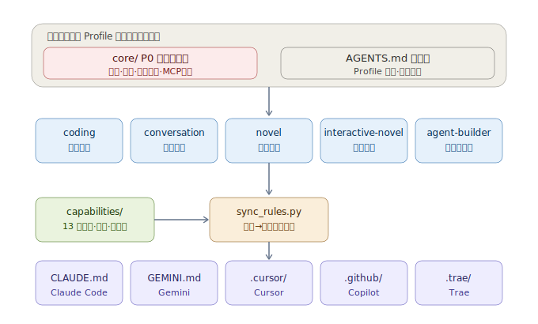
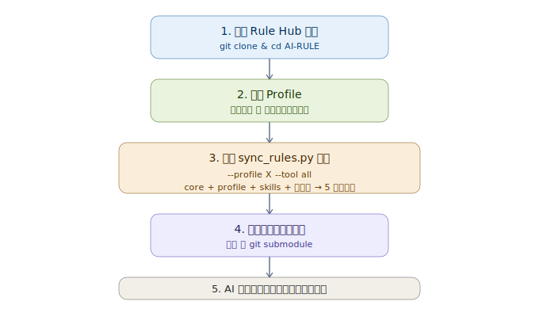
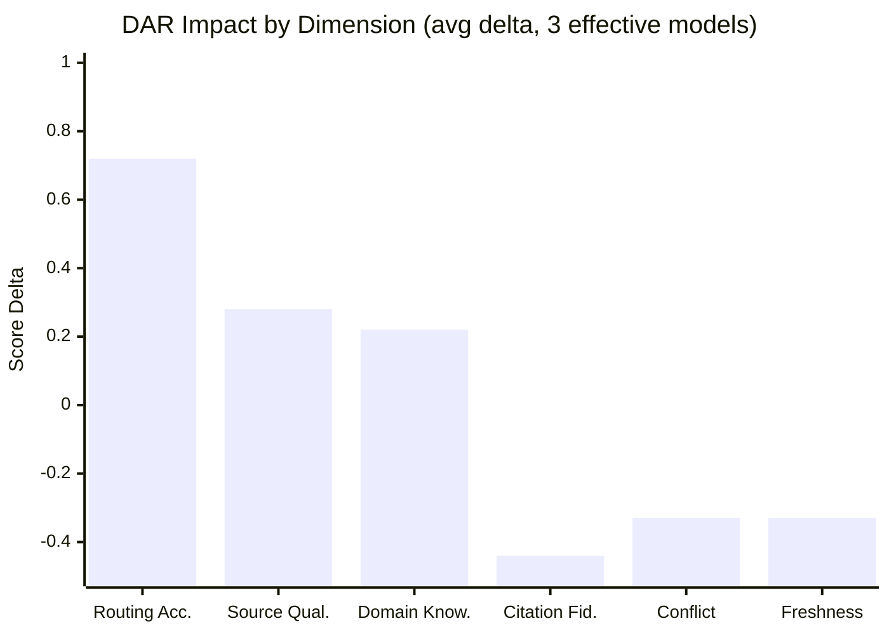

# Rule Hub — Unified AI Collaboration Rules

[English] · [中文](README_CN.md) · [日本語](README_JA.md)


> A single repository integrating 6 independent rule systems: core layer + one active profile + capability packs.
> Clone once, pick a profile, sync to any AI tool's rule file.

---

## What This Repository Is

This is the **single source of truth for AI collaboration rules** — not application code for any specific project. It consolidates 6 previously separate rule repositories into one, loaded by profile to avoid domain conflicts (e.g., "no fabrication" vs. "novel writing requires fiction").

| Profile | Origin | Use Case |
|---|---|---|
| `coding` | badhope/AI | Software development, bug fixes, refactoring, code review |
| `conversation` | badhope/universal | General Q&A, research, comparison, information retrieval |
| `novel` | badhope/novel | Novel writing, chapter creation, character/worldbuilding |
| `interactive-novel` | badhope/interactive-novel | Interactive fiction, branching narratives, state machines |
| `paper` | badhope/paper | Academic paper writing, literature review, submission |
| `agent-builder` | badhope/AgentCreater | Design, evaluate, and deploy AI agents |

**Why merge**: stop 5 rule sets from drifting apart; clone one repo instead of five; unify the cross-tool sync entry point.

**Why not merge into one set**: domain constraints conflict (e.g., "no fabrication" vs. "fiction is the core ability"). Profiles are loaded in isolation.

## Quick Start

### 1. Clone

```bash
git clone https://gitcode.com/badhope/AI-RULE.git
cd AI-RULE
```

### 2. Pick a Profile and Generate Tool Entries

```bash
# List available profiles
python scripts/sync_rules.py --list

# Generate Claude Code entry for the coding profile
python scripts/sync_rules.py --profile coding --tool claude-code

# Generate all tool entries for the novel profile
python scripts/sync_rules.py --profile novel --tool all
```

### 3. Use in Your Project

Copy the generated tool entry file (e.g., `CLAUDE.md`) to your project root, or reference this repo as a Git submodule and run the sync script.

### 4. Tell AI Which Profile to Load

```text
Load the coding Profile from Rule Hub.
```

Or let the project anchors auto-detect (see below).

## Profile Selection

### Explicit (recommended)

```text
Load the <profile-id> Profile from Rule Hub.
```

### Auto-Detection by Project Anchors

| Anchor Signal | Inferred Profile |
|---|---|
| `pyproject.toml`, `package.json`, `requirements.txt` + source code | `coding` |
| `.ai-memory/creative-blueprint.md`, `chapters/`, `outline.md` | `novel` |
| `.game-state/`, `game-state-machine.md`, `save-slot-*.json` | `interactive-novel` |
| `config.yaml` + `tools.json` + `test-cases.md` | `agent-builder` |
| None of the above | `conversation` |

### Intent Keywords

| Keywords | Profile |
|---|---|
| fix / refactor / test / API / bug | `coding` |
| write a chapter / continue / character / foreshadowing / worldbuilding | `novel` |
| start a game / branch / save / NPC / turn | `interactive-novel` |
| design Agent / agent config / tool permissions | `agent-builder` |
| query / compare / analyze / research | `conversation` |

## The 6 Profiles

### coding (Software Development)
- **Origin**: badhope/AI
- **Scope**: Python/FastAPI development, bug fixes, refactoring, testing, code review
- **Core capabilities**: Git SOP, dependency management, PowerShell syntax, MCP red lines, engineering hygiene
- **Capability packs**: research, testing, review, agent-governance, dar
- **Mutually exclusive with**: novel, interactive-novel

### conversation (General Conversation)
- **Origin**: badhope/universal
- **Scope**: General Q&A, research, comparison, information retrieval
- **Core capabilities**: truth protocol, deep search, anti-dumbing-down, clarification protocol, reasoning depth control
- **Capability packs**: research, dar
- **Mutually exclusive with**: novel, interactive-novel, agent-builder

### novel (Novel Writing)
- **Origin**: badhope/novel
- **Scope**: Novel writing, chapter creation, character/worldbuilding maintenance
- **Core capabilities**: creative seed confirmation, 35-item anti-AI-literary-flavor checklist, character consistency, foreshadowing tracking, story knowledge graph, three-tier revision
- **Capability packs**: research, worldbuilding, creative, dar
- **Mutually exclusive with**: coding, conversation, interactive-novel, agent-builder

### interactive-novel (Interactive Fiction)
- **Origin**: badhope/interactive-novel
- **Scope**: Interactive fiction games, branching narratives, state machine driven
- **Core capabilities**: game seeds, state machine, NPC autonomy, adaptive difficulty, save/load, turn-based
- **Capability packs**: creative, research, state-machine, npc-simulation, adaptive-difficulty, dar
- **Mutually exclusive with**: coding, conversation, novel, agent-builder

### paper (Academic Paper Writing)
- **Origin**: badhope/paper
- **Scope**: Academic paper writing, literature review, submission, reviewer response
- **Core capabilities**: academic integrity protocol, citation verification, literature review methodology, paper structure (IMRaD/Review/Position/Case Study), research question extraction, methodology design, data presentation, anti-AI-academic-tone, peer review simulation, revision letter response
- **Capability packs**: research, dar
- **Mutually exclusive with**: novel, interactive-novel

### agent-builder (Agent Construction)
- **Origin**: badhope/AgentCreater
- **Scope**: Design, evaluate, and deploy AI agents — produce config, tool definitions, test cases
- **Core capabilities**: four-layer role model, CTCO prompt structure, tool side-effect grading, memory systems, evaluation framework, 6 executable templates
- **Capability packs**: research, agent-governance, engineering, testing, dar
- **Mutually exclusive with**: conversation, novel, interactive-novel

## Architecture



Single-source rules (`core/` layer + `AGENTS.md` selector) are assembled per profile, then `sync_rules.py` generates entry files for each AI tool.

## Usage Flow



Clone repo → pick profile → run sync → import to project → AI works under unified rules (consistent across tools).

## Repository Structure

```
AI-RULE/
├── AGENTS.md                    # Rule hub entry (selector + priority + language mediation)
├── core/                        # P0 hard constraints shared by all profiles
│   ├── governance.md            # Security, permissions, MCP red lines, circuit breaker
│   ├── interaction.md           # Clarification, intent normalization, output spec
│   ├── profile-router.md        # Profile selection and capability pack whitelist
│   ├── language-mediation.md    # Language mediation protocol (English reasoning, user-language output)
│   └── dar-spec.md              # DAR (Domain Authority Registry) unified spec
├── profiles/                    # 6 independent rule sets
│   ├── coding/          ( 13 files)
│   ├── conversation/    ( 19 files)
│   ├── novel/           ( 28 files)
│   ├── interactive-novel/ (31 files)
│   ├── paper/           ( 22 files)
│   └── agent-builder/   ( 70 files)
├── capabilities/                # 14 on-demand capability packs (incl. dar/ domain registry)
├── manifests/                   # Per-profile assembly manifests
├── scripts/sync_rules.py        # Generate tool entry files per profile
└── tests/                       # 6 test suites (51 checks, all passing)
```

## Language Mechanism

All **system prompts** are written in **English** (for reasoning precision); rule documentation uses bilingual Chinese-English for clarity. The AI communicates with you in **your language**:

1. **Input**: auto-detect your language → identify intent → reason internally in English
2. **Output**: generate in English → translate to your language → polish against translationese

See `core/language-mediation.md` for details.

## Supported AI Tools

The sync script generates rule entries for:

| Tool | Output File |
|---|---|
| Claude Code | `CLAUDE.md` |
| Gemini | `GEMINI.md` |
| Cursor | `.cursor/rules/project.mdc` |
| GitHub Copilot | `.github/copilot-instructions.md` |
| Trae | `.trae/rules/project_rules.md` |

```bash
# Single tool
python scripts/sync_rules.py --profile coding --tool claude-code

# All tools
python scripts/sync_rules.py --profile coding --tool all
```

## Research-Backed Optimizations

This repository incorporates findings from recent prompt engineering and AI alignment research:

- **Instruction Budget**: Empirical research (ManyIFEval, ICLR 2025) shows instruction adherence degrades as a power law with simultaneous instruction count. P0 rules are capped at ≤5 simultaneously active; total hard constraints ≤12.
- **Position Effects (Lost in the Middle)**: LLMs attend to the beginning and end of context, under-weighting the middle. P0 rules are placed at both ends of the context window.
- **Anti-Patterns**: ALL CAPS emphasis, negative-only constraints, and manual "think step by step" are empirically ineffective on next-gen models (Claude 4.x, GPT-4.1). Rules are written with conditional logic and positive alternatives.
- **Extended Thinking**: Model-native reasoning budget (Claude 4.x / OpenAI o-series) replaces manual CoT for complex tasks.
- **Three-Tier Behavior Boundaries**: Allowed (autonomous) / Confirmation Required / Forbidden — replacing vague "appropriate behavior" declarations.
- **GUID Delimiter Injection Defense**: Random GUID-based delimiters replace fixed `[UNTRUSTED]` markers, preventing marker-closing injection attacks.
- **Abstention Protocol**: Explicit permission to say "I don't know" with anti-inflation guards — preventing confident fabrication.
- **Self-Refinement**: Reflexion loops and Constitutional self-critique for pre-output quality checking.

See `profiles/agent-builder/docs/skills/` for full documentation.

## Verification

```bash
pytest tests/                        # 6 suites, 51 checks, all passing
# Or run individually: pytest tests/test_audit.py
```

## DAR Multi-Model Evaluation Results

> 10 models tested across 6 scenarios (120 API calls), objectively comparing **baseline** (no DAR) vs **enhanced** (with DAR routing/scoring/domain-knowledge prompts).
> Full report: [`tests/dar-evaluation/multi-model-report.md`](tests/dar-evaluation/multi-model-report.md) · Raw data: [`tests/dar-evaluation/full-test-results.json`](tests/dar-evaluation/full-test-results.json)

### Test Scope

| Dimension | Coverage |
|-----------|----------|
| Models tested | 10 (1 primary API + 9 backup API) |
| Scenarios | 6 (coding / conversation / paper / novel / agent-builder) |
| Languages | English · 中文 · 日本語 |
| Total API calls | 120 (baseline + enhanced) |
| Valid results | 60 |
| Scoring | 6 dimensions × 0–5 = /30 per scenario |

### Model Availability & Summary

| Model | API | Status | Baseline | Enhanced | Δ |
|-------|-----|--------|----------|----------|---|
| **Qwen3.5-397B-A17B** | backup | ✅ Available | 18.3 | 20.5 | **+2.2** |
| DeepSeek-V4-Pro | backup | ✅ Available | 15.8 | 15.2 | -0.7 |
| moonweaver-4.8 | primary | ✅ Available | 14.3 | 13.2 | -1.2 |
| DeepSeek-V4-Flash | backup | ⚠ Partial | 7.0 | 4.5 | -2.5 |
| glm-4.7 | backup | ⚠ Partial | 7.5 | 5.0 | -2.5 |
| step-3.7-flash | backup | ⚠ Low quality | 2.8 | 2.0 | -0.8 |
| glm-5.2 | backup | ❌ Timeout | — | — | — |
| Kimi-K2.6 | backup | ❌ Timeout | — | — | — |
| MiniMax-M3 | backup | ❌ Timeout | — | — | — |
| Spark-X2-Flash | backup | ❌ Auth fail | — | — | — |
| sensenova-u1-fast | backup | ❌ Not found | — | — | — |

### Score Comparison — 3 Effective Models

```mermaid
xychart-beta
    title "DAR Enhancement: Baseline vs Enhanced (avg score /30)"
    x-axis ["Qwen3.5-397B", "DeepSeek-V4-Pro", "moonweaver-4.8"]
    y-axis "Average Score" 0 --> 25
    bar [18.3, 15.8, 14.3]
    bar [20.5, 15.2, 13.2]
```



### DAR Improvement Heat Map

| Scenario | moonweaver-4.8 | DeepSeek-V4-Pro | Qwen3.5-397B-A17B |
|----------|:--------------:|:---------------:|:-----------------:|
| S1-CVE (coding) | **+14** 🟢 | 0 ⚪ | +1 🟢 |
| S2-GDP (中文) | -3 🔴 | -11 🔴 | **+2** 🟢 |
| S3-ACADEMIC | -19 🔴 | +3 🟢 | **+5** 🟢 |
| S4-NOVEL | +3 🟢 | **+7** 🟢 | **+11** 🟢 |
| S5-JP (日本語) | 0 ⚪ | **+4** 🟢 | -2 🔴 |
| S6-AGENT | -2 🔴 | -7 🔴 | -4 🔴 |

> 🟢 = DAR improvement · ⚪ = no change · 🔴 = DAR regression

### Six-Dimension Analysis



**DAR improves**: Routing Accuracy (+0.72, core value), Source Quality (+0.28), Domain Knowledge (+0.22)

**DAR does not improve**: Citation Fidelity (-0.44), Conflict Handling (-0.33), Freshness Awareness (-0.33)

### Key Findings

1. **DAR excels in domain-specific scenarios** — S4-NOVEL (+11) and S1-CVE (+14) where models lack specialized source knowledge (Etymonline, NVD)
2. **DAR's routing rules are its greatest value** — Routing Accuracy improved +0.72, far exceeding other dimensions
3. **Qwen3.5-397B-A17B is the most DAR-compatible model** — 4/6 scenarios improved, avg +2.2
4. **Long DAR prompts can hurt small models** — moonweaver-4.8 returned empty on S3-ACADEMIC (−19)
5. **DAR adds noise when baseline is already strong** — S6-AGENT regressed across all models

### Optimization Roadmap

1. Compress DAR prompt prefix from 200–400 words to <100 words
2. Provide a lite DAR (routing only) for smaller models
3. Append "all factual claims must cite URL + date" to strengthen Citation Fidelity
4. Skip DAR enhancement when baseline score already exceeds 20/30
5. Refine Chinese DAR prompt wording to avoid disrupting model comprehension

## Capability Packs

Capability packs are composable, on-demand work methods. They don't define agent identity — the profile does. Packs only provide methodology.

| Pack | Use Case |
|---|---|
| `research` | Fact support, data validation |
| `testing` | Writing/verifying tests |
| `review` | Code/content review |
| `engineering` | Engineering implementation |
| `creative` | Creative generation, style, revision |
| `worldbuilding` | Worldbuilding, characters, timelines |
| `state-machine` | State machine governance, branch reachability |
| `npc-simulation` | NPC autonomy, memory, relationships |
| `adaptive-difficulty` | Difficulty adaptation |
| `game-engine` | Game turns, saves, commands |
| `agent-governance` | Agent evaluation, observability, safety alignment |
| `orchestration` | Multi-agent orchestration |
| `novel-chapter-deliverable-mode` | Novel chapter delivery mode |
| `dar` | Domain Authority Registry — authoritative source lists, scoring, routing |

See `capabilities/README.md`.

## Rule Priority

Higher priority wins on conflict:

```
P0: core/ security, permissions, truthfulness, MCP red lines
> P1: user's current explicit confirmation
> P2: main profile domain rules
> P3: capability pack on-demand rules
> P4: model default behavior
```

## Boundaries

**Can guarantee**:
- Profiles are mutually exclusive and conflict-free
- Manifest references are complete
- Generated files come from specified sources
- Rule sets include core + profile + skills three layers
- Hand-edited generated files can be overwritten by re-syncing

**Cannot guarantee**:
- Any model 100% executes natural language rules
- Rule files alone prevent dangerous operations (needs tool permissions, Git hooks, human confirmation)
- Auto-configuration of Trae custom agents or MCP after cloning (manual setup required)

## Repository

This repository is mirrored on both GitCode and GitHub with identical content:

- GitCode (primary): https://gitcode.com/badhope/AI-RULE
- GitHub (mirror): https://github.com/weed33834/AI-RULE

## License

MIT

---

## Star History

[](https://star-history.com/#weed33834/AI-RULE&Date)

<div align="center">

[↑ Back to Top](#rule-hub--unified-ai-collaboration-rules)

</div>
