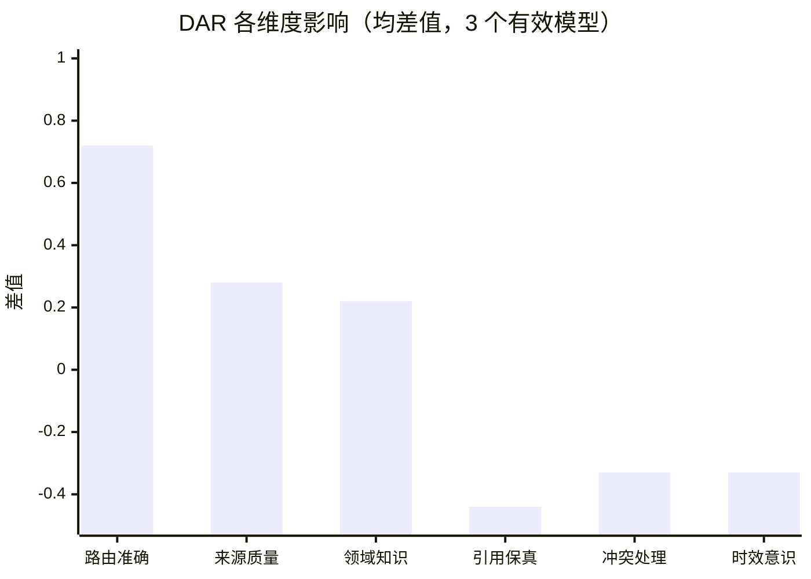

# ▲ Rule Hub — 统一规则中枢（中文）

[English](README.md) · [中文] · [日本語](README_JA.md)


> 6 套独立规则体系的单仓整合：核心层 + 单一主 Profile + 能力包。
> 克隆一次，按场景选择 Profile，同步生成各 AI 工具的规则入口。

---

## 这个仓库是干嘛的

本仓库是 **AI 协作规则的唯一权威来源**，不是任何具体开发项目的业务代码。它整合了 6 套原本独立的规则仓库（coding / conversation / novel / interactive-novel / paper / agent-builder），按场景隔离加载，避免"禁止虚构"与"小说必须能虚构"这类领域约束互相冲突。

**为什么合并**：避免 6 套规则各自漂移、避免每次使用克隆多个仓库、统一跨工具同步入口。
**为什么不揉成一套**：领域约束互斥，必须按 Profile 隔离。

## 核心架构


单源规则（`core/` 层 + `AGENTS.md` 选择器）按 Profile 装配，经 `sync_rules.py` 生成各 AI 工具入口文件。能力包（capabilities）按 Profile 白名单按需拼入，保证"改一处、全工具生效"。

## 使用思路


克隆仓库 → 确定 Profile → 运行 sync 装配 → 引入项目 → AI 按统一规则工作（跨工具一致）。

## 快速开始

### 1. 克隆仓库

```bash
git clone https://gitcode.com/badhope/AI-RULE.git
cd AI-RULE
```

### 2. 选择 Profile 并生成工具入口

```bash
# 列出可用 Profile
python scripts/sync_rules.py --list

# 为 coding Profile 生成 Claude Code 入口
python scripts/sync_rules.py --profile coding --tool claude-code

# 为 novel Profile 生成所有工具入口
python scripts/sync_rules.py --profile novel --tool all
```

### 3. 在目标项目使用

把生成的工具入口文件（如 `CLAUDE.md`）复制到你的项目根目录，或用 Git 子模块引用本仓库后运行同步脚本。

### 4. 告诉 AI 加载哪个 Profile

在对话开始时指定：

```text
按 Rule Hub 加载 coding Profile。
```

或由项目锚点自动识别（见下文）。

## Profile 选择

### 显式指定（推荐）

```text
按 Rule Hub 加载 <profile-id> Profile。
```

### 项目锚点自动识别

| 锚点信号 | 推断 Profile |
|---|---|
| `pyproject.toml`、`package.json`、`requirements.txt` + 源码 | `coding` |
| `.ai-memory/creative-blueprint.md`、`chapters/`、`outline.md` | `novel` |
| `.game-state/`、`game-state-machine.md`、`save-slot-*.json` | `interactive-novel` |
| `config.yaml` + `tools.json` + `test-cases.md` | `agent-builder` |
| 无上述锚点 | `conversation` |

### 意图关键词

| 关键词 | Profile |
|---|---|
| 修复/重构/测试/接口/Bug | `coding` |
| 写一章/续写/人物/伏笔/世界观 | `novel` |
| 开始一局/分支/存档/NPC/回合 | `interactive-novel` |
| 设计 Agent/智能体配置/工具权限 | `agent-builder` |
| 查询/对比/分析/调研 | `conversation` |

## 6 个 Profile 详细说明

### coding（软件开发）
- **来源**：badhope/AI
- **适用**：Python/FastAPI 开发、Bug 修复、重构、测试、代码审查
- **核心能力**：Git SOP、依赖管理、PowerShell 语法、MCP 红线、工程卫生
- **可叠加能力包**：research、testing、review、agent-governance、dar
- **互斥**：novel、interactive-novel

### conversation（通用对话）
- **来源**：badhope/universal
- **适用**：通用问答、调研、方案对比、信息检索
- **核心能力**：真实性协议、深度搜索、反降智、澄清协议、推理深度控制
- **可叠加能力包**：research、dar
- **互斥**：novel、interactive-novel、agent-builder

### novel（小说创作）
- **来源**：badhope/novel
- **适用**：小说写作、章节创作、角色/世界观维护
- **核心能力**：创作种子确认、去 AI 文学味、角色一致性、伏笔追踪、故事知识图谱、三层修订
- **可叠加能力包**：research、worldbuilding、creative、dar
- **互斥**：coding、conversation、interactive-novel、agent-builder

### interactive-novel（互动小说游戏）
- **来源**：badhope/interactive-novel
- **适用**：互动小说游戏、分支叙事、状态机驱动
- **核心能力**：游戏种子、状态机、NPC 自主性、自适应难度、存档/读档、回合制
- **可叠加能力包**：creative、research、state-machine、npc-simulation、adaptive-difficulty、dar
- **互斥**：coding、conversation、novel、agent-builder

### paper（学术论文写作）
- **来源**：badhope/paper
- **适用**：学术论文写作、文献综述、投稿、审稿回复
- **核心能力**：学术诚信协议、引用验证流程、文献综述方法论、论文结构框架（IMRaD/Review/Position/Case Study）、研究问题提炼、方法论设计、数据呈现、去AI学术味、模拟同行评审、修订信回复
- **可叠加能力包**：research、dar
- **互斥**：novel、interactive-novel

### agent-builder（智能体构建）
- **来源**：badhope/AgentCreater
- **适用**：设计/评估/部署智能体，产出 config、工具定义、测试用例
- **核心能力**：角色四层模型、CTCO 提示词结构、工具副作用分级、记忆系统、评估框架、可执行模板
- **可叠加能力包**：research、agent-governance、engineering、testing、dar
- **互斥**：conversation、novel、interactive-novel

## 仓库结构

```
AI-RULE/
├── AGENTS.md                    # 规则中枢入口（选择器 + 优先级 + 语言中介）
├── core/                        # 所有 Profile 共享的 P0 硬约束（4 文件）
│   ├── governance.md            # 安全、权限、MCP 红线、失败熔断
│   ├── interaction.md           # 澄清、意图归一化、输出规范
│   ├── profile-router.md        # Profile 选择与能力包白名单
│   └── language-mediation.md    # 语言中介协议（提示英语、输出用户语言）
├── profiles/                    # 6 套独立规则
│   ├── coding/          ( 13 文件)
│   ├── conversation/    ( 19 文件)
│   ├── novel/           ( 28 文件)
│   ├── interactive-novel/ (31 文件)
│   ├── paper/           ( 22 文件)
│   └── agent-builder/   ( 70 文件)   # 合计 183 文件
├── capabilities/                # 14 个按需能力包（capabilities/*.md + dar/）
├── manifests/                   # 每个 Profile 的装配清单
├── adapters/                    # 可选工具追加片段（扩展点，sync_rules.py 检测，不存在时跳过）
├── provenance/                  # 生成溯源记录（JSON，已 gitignore）
├── scripts/sync_rules.py        # 按 Profile 生成各工具入口
└── tests/                       # 6 套测试（51 项检查，全部通过）
```

> 真实统计：6 个 Profile 合计 **183** 个文件；`capabilities/` 14 个能力包；`core/` 5 个文件；仓库总文件 **245**（不含 `.git`）。

## 语言机制

所有 **系统提示词（system-prompt.md）** 用 **英语** 编写（保证推理精度），规则文档使用中英双语以兼顾清晰度。AI 与你交流时用 **你的语言**：

1. **输入**：自动检测你的语言 → 识别真实意图 → 英语内部推理
2. **输出**：英语生成 → 翻译回你的语言 → 反翻译腔润色

详见 `core/language-mediation.md`。

## 支持的 AI 工具

同步脚本可为以下工具生成规则入口：

| 工具 | 输出文件 |
|---|---|
| Claude Code | `CLAUDE.md` |
| Gemini | `GEMINI.md` |
| Cursor | `.cursor/rules/project.mdc` |
| GitHub Copilot | `.github/copilot-instructions.md` |
| Trae | `.trae/rules/project_rules.md` |

```bash
# 单工具
python scripts/sync_rules.py --profile coding --tool claude-code

# 全部工具
python scripts/sync_rules.py --profile coding --tool all
```

## 研究驱动的优化

本仓库融合了提示词工程与 AI 对齐领域的最新研究成果：

- **指令预算 (Instruction Budget)**：ManyIFEval (ICLR 2025) 证明同时激活的指令越多，单条指令的遵循率越低（幂律衰减）。P0 红线规则限制在 ≤5 条同时激活，全部硬约束 ≤12 条。
- **位置效应 (Lost in the Middle)**：大模型对上下文的注意力呈 U 型——首尾被重视，中间被弱化。P0 规则放在上下文窗口的首尾两端。
- **反模式 (Anti-Patterns)**：全大写强调、纯否定式约束、手写"一步步思考"在新一代模型上已失效。规则采用条件逻辑 + 正向替代写法。
- **扩展思考 (Extended Thinking)**：Claude 4.x / OpenAI o 系列的原生推理预算分配取代手动 CoT，用于复杂推理任务。
- **三层行为边界**：允许（自主执行）/ 需确认 / 禁止——替代模糊的"适当行为"声明。
- **GUID 分隔符注入防御**：随机 GUID 分隔符替代固定 `[UNTRUSTED]` 标记，防止标记闭合逃逸攻击。
- **弃权协议 (Abstention Protocol)**：允许说"我不知道"，同时防止虚张声势——避免自信地编造。
- **自我精炼 (Self-Refinement)**：Reflexion 循环与 Constitutional 自我批评，在输出前做质量自检。

详见 `profiles/agent-builder/docs/skills/`。

## 验证测试

```bash
pytest tests/                        # 6 套测试，51 项检查，全部通过
# 或单文件运行：pytest tests/test_audit.py
```

全部 51 项检查通过（测试为 pytest 函数风格，需先安装 pytest）。

## DAR 多模型实测评估

> 10 个模型 × 6 场景（120 次 API 调用），客观对比 **基准**（无 DAR）vs **增强**（含 DAR 路由/打分/领域知识提示词）。
> 完整报告：[`tests/dar-evaluation/multi-model-report.md`](tests/dar-evaluation/multi-model-report.md) · 原始数据：[`tests/dar-evaluation/full-test-results.json`](tests/dar-evaluation/full-test-results.json)

### 测试规模

| 维度 | 覆盖 |
|------|------|
| 测试模型数 | 10（主接口 1 + 备用接口 9） |
| 测试场景数 | 6（coding / conversation / paper / novel / agent-builder） |
| 语言覆盖 | English · 中文 · 日本語 |
| 总 API 调用数 | 120（基准 + 增强） |
| 有效结果数 | 60 |
| 评分方式 | 6 维度 × 0–5 分 = /30 每场景 |

### 模型可用性与总览

| 模型 | 接口 | 状态 | 基准均分 | 增强均分 | 差值 |
|------|------|------|---------|---------|------|
| **Qwen3.5-397B-A17B** | 备用 | ✅ 可用 | 18.3 | 20.5 | **+2.2** |
| DeepSeek-V4-Pro | 备用 | ✅ 可用 | 15.8 | 15.2 | -0.7 |
| moonweaver-4.8 | 主接口 | ✅ 可用 | 14.3 | 13.2 | -1.2 |
| DeepSeek-V4-Flash | 备用 | ⚠ 部分 | 7.0 | 4.5 | -2.5 |
| glm-4.7 | 备用 | ⚠ 部分 | 7.5 | 5.0 | -2.5 |
| step-3.7-flash | 备用 | ⚠ 低质 | 2.8 | 2.0 | -0.8 |
| glm-5.2 | 备用 | ❌ 超时 | — | — | — |
| Kimi-K2.6 | 备用 | ❌ 超时 | — | — | — |
| MiniMax-M3 | 备用 | ❌ 超时 | — | — | — |
| Spark-X2-Flash | 备用 | ❌ 授权失败 | — | — | — |
| sensenova-u1-fast | 备用 | ❌ 模型不存在 | — | — | — |

### 得分对比 — 3 个有效模型

```mermaid
xychart-beta
    title "DAR 增强：基准 vs 增强（均分 /30）"
    x-axis ["Qwen3.5-397B", "DeepSeek-V4-Pro", "moonweaver-4.8"]
    y-axis "平均得分" 0 --> 25
    bar [18.3, 15.8, 14.3]
    bar [20.5, 15.2, 13.2]
```



### DAR 提升热力图

| 场景 | moonweaver-4.8 | DeepSeek-V4-Pro | Qwen3.5-397B-A17B |
|------|:--------------:|:---------------:|:-----------------:|
| S1-CVE（安全漏洞） | **+14** 🟢 | 0 ⚪ | +1 🟢 |
| S2-GDP（中文事实核查） | -3 🔴 | -11 🔴 | **+2** 🟢 |
| S3-ACADEMIC（学术综述） | -19 🔴 | +3 🟢 | **+5** 🟢 |
| S4-NOVEL（历史小说） | +3 🟢 | **+7** 🟢 | **+11** 🟢 |
| S5-JP（日本語技術） | 0 ⚪ | **+4** 🟢 | -2 🔴 |
| S6-AGENT（模型选型） | -2 🔴 | -7 🔴 | -4 🔴 |

> 🟢 = DAR 提升 · ⚪ = 持平 · 🔴 = DAR 下滑

### 六维度分析



**DAR 提升的维度**：路由准确度（+0.72，核心优势）、来源质量（+0.28）、领域知识（+0.22）

**DAR 未提升的维度**：引用保真度（-0.44）、冲突处理（-0.33）、时效意识（-0.33）

### 核心发现

1. **DAR 在领域冷门场景提升最大** — S4-NOVEL（+11）、S1-CVE（+14），这些场景需要专业工具（Etymonline、NVD），模型本身缺乏相关知识
2. **DAR 路由规则是最大价值点** — 路由准确度提升 +0.72，远超其他维度
3. **Qwen3.5-397B-A17B 与 DAR 兼容性最好** — 4/6 场景正向提升，均分 +2.2
4. **长 DAR 提示词可能破坏小模型** — moonweaver-4.8 在 S3-ACADEMIC 返回空响应（-19）
5. **强基线场景 DAR 反而引入噪音** — S6-AGENT 全部模型下滑

### 优化路线

> 以下 5 条路线已完成闭环迭代验证，详见 [`tests/dar-evaluation/v2-optimization-design.md`](tests/dar-evaluation/v2-optimization-design.md)。

1. ✅ **精简 DAR 前缀** — 从 200–400 字压缩到 150–220 字（standard 变体）
2. ✅ **自适应双变体** — 为小模型保留 200–400 字详尽式（extended 变体），大模型使用压缩式
3. ✅ **3 条硬约束** — ①事实附 URL+日期 ②来源冲突呈现分歧 ③数据标注年份并降权
4. ✅ **多维评分体系** — 5 场景 × 3 复杂度 × 2 用户类型 = 30 用例，每场景 4 维评分
5. ✅ **过拟合防护** — gold set/held-out set 分离 + 多模型交叉验证 + 泛化检查

### DAR v1→v2→v3→v4 迭代结果

三轮 A/B 测试（3 模型 × 30 用例 × 3 轮 = 270+ 次 API 调用）：

| 版本 | 大模型 (Qwen3.5) | 小模型 (moonweaver) | 关键变更 |
|------|-----------------|---------------------|----------|
| v1 | 16.5 | 11.5 | 详尽式前缀（200-400 字） |
| v2 | 16.8 | 8.5 | 压缩式 + 3 硬约束 |
| v3 | **17.3** | 7.8 | v2 + 恢复 coding/agent 可执行指引 |
| v4 | 17.6* | **14.2** | **自适应**: 大模型 standard + 小模型 extended |

\* v4 大模型用 10 用例验证，v2 在同 10 用例上均分为 17.7（采样偏差，全集 30 用例 v2=16.8）。

**核心发现**：大模型从短前缀推断意图（v3/v4 standard），小模型需要明确详尽指导（v1 extended）。这与提示词工程研究一致——模型容量与最佳指令长度呈反相关。

**v4 自适应方案验证**：小模型 +6.1（8.1→14.2），大模型 -0.1（中性），4/5 场景正向提升。

## 能力包

能力包是按需加载的可组合工作方法，不定义智能体身份。主 Profile 决定身份，能力包只提供方法。`sync_rules.py` 仅拼入该 Profile `enables_capabilities` 列出的能力包；`forbids_capabilities` 因不在加载清单中而自然不会被拼入（白名单语义）。

| 能力包 | 适用 |
|---|---|
| `research` | 事实支撑、数据验证 |
| `testing` | 编写/验证测试 |
| `review` | 代码/内容审查 |
| `engineering` | 工程实现 |
| `creative` | 创意生成、文风、修订 |
| `worldbuilding` | 世界观、角色、时间线 |
| `state-machine` | 状态机治理、分支可达性 |
| `npc-simulation` | NPC 自主性、记忆、关系 |
| `adaptive-difficulty` | 难度自适应 |
| `game-engine` | 游戏回合、存档、命令 |
| `agent-governance` | 智能体评估、观测、安全对齐 |
| `orchestration` | 多智能体编排 |
| `novel-chapter-deliverable-mode` | 小说章节交付模式 |
| `dar` | 域权威注册表——权威源名录、打分公式、检索路由 |

详见 `capabilities/README.md`。

## 规则优先级

冲突时高优先级胜出：

```
P0：core/ 安全、权限、真实性、MCP 红线
> P1：用户当前明确确认
> P2：主 Profile 领域规则
> P3：能力包按需规则
> P4：模型默认行为
```

## 扩展点

- **`adapters/`**：可选工具追加片段。在 `adapters/<tool>.md` 或 `adapters/<tool>/append.md` 放入内容，`sync_rules.py` 生成该工具文件时会追加到末尾（例如某工具需要专属补充规则）。当前为空，属预留扩展点。
- **`provenance/`**：每次生成的溯源记录（JSON，含生成时间、profile、输出文件、内容 hash、大小），已加入 `.gitignore`，不入库。可用于核对某份生成文件由哪个 Profile、何时、什么内容生成。

## 重要边界

**能保证**：
- Profile 互斥不冲突
- manifest 引用完整（缺失文件在生成产物中标记为 `[missing]`）
- 生成文件来自指定源（core + profile + skills + 启用的能力包）
- 手改生成文件可被重新生成覆盖

**不能保证**：
- 任意模型 100% 执行自然语言规则
- 单靠规则文件阻止危险操作（需工具权限、Git 钩子、人工确认）
- 克隆后自动配置 Trae 自定义 Agent 或 MCP（必须手动配置）

## 安全与保密红线（节选）

- API Key / Token / 密码一律通过 `os.getenv()` 读取，保持源代码中无硬编码凭证。
- `.env` 需列入 `.gitignore`，确保其不出现在 Git 历史中。
- 拉取外部模板时只包含请求的文件，排除其 `.git`、LICENSE、README 等无关文件。
- 提交前用 `git status` 检查意外文件；`git push` 需用户确认后再执行，`git push -f` 仅在明确批准时使用，暂存用 `git add <path>` 逐个指定而非 `git add .`。

## MCP 怎么配（通用）

MCP 涉及常驻进程与权限，**配置权在你手里**：AI 禁止自下载、自安装、自启动、自配置 MCP（见 `core/governance.md` 红线）。你从 `profiles/coding/docs/skills/mcp-registry.md` 挑选可信服务，按各工具配置文件手动粘贴 `mcp.example.json` 里对应的 JSON，把占位符换成你的环境变量。

## 仓库地址

本仓库在 GitCode 与 GitHub 同步托管，内容完全一致：

- GitCode（主仓库）：https://gitcode.com/badhope/AI-RULE
- GitHub（镜像）：https://github.com/weed33834/AI-RULE

## 许可证

MIT

---

## Star History

[](https://star-history.com/#weed33834/AI-RULE&Date)

<div align="center">

[↑ 返回顶部](#-rule-hub--统一规则中枢中文)

</div>
